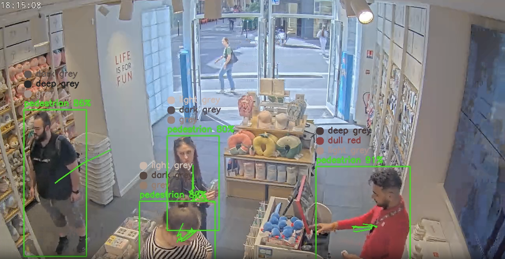
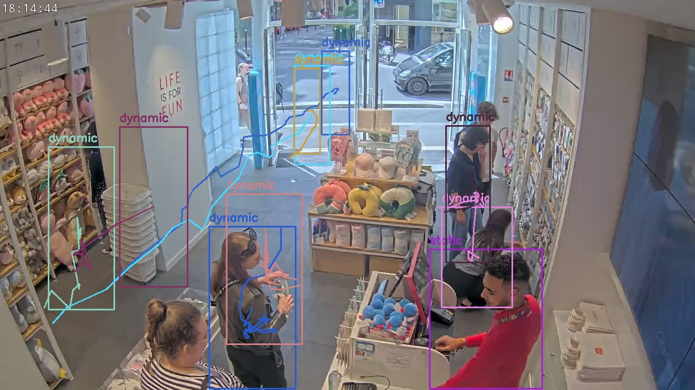

# Object Classification Utilising yoloV8

The repository includes all the scripts necessary for object classification, utilizing [`yoloV8`](https://yolov8.com) for [object detection](https://docs.ultralytics.com/tasks/detect/), [segmentation](https://docs.ultralytics.com/tasks/segment/), and [classification](https://docs.ultralytics.com/tasks/classify/). It integrates with [`RabbitMQ`](https://www.rabbitmq.com) to receive messages and retrieves media from the [`Kerberos Vault`](https://kerberos.io/product/vault/) based on the message details. Upon receiving the video, objects are detected, segmented, and classified, while the primary colors of the objects are simultaneously calculated. The frame is annotated with this information and can be saved locally. Additionally, the results are stored in a JSON object. More features are available and will be detailed in a subsequent paragraph.

<p align="center"></p>

## Prerequisites

To correctly install the necessary dependencies, run the following command. It is recommended to use a virtual environment for this process:

```sh
pip install -r requirements.txt
```

## Features & Corresponding .env Variables

This repository offers numerous options and additional features to optimally configure it to your needs. Below is a list of all available features and their corresponding .env variable names. These variables can be modified in the included .env file.

* ### Utilized Model
YOLOv8 offers a range of models catering to various accuracy-performance trade-offs. Among these, [`yolov8n.pt`](https://docs.ultralytics.com/models/yolov8/#supported-tasks-and-modes) is the most performance-focused, while [`yolov8x.pt`](https://docs.ultralytics.com/models/yolov8/#supported-tasks-and-modes) emphasizes accuracy. Intermediate models such as [`yolov8s`](https://docs.ultralytics.com/models/yolov8/#supported-tasks-and-modes), [`yolov8m`](https://docs.ultralytics.com/models/yolov8/#supported-tasks-and-modes), and [`yolov8l`](https://docs.ultralytics.com/models/yolov8/#supported-tasks-and-modes) progressively balance performance and accuracy. The aforementioned models are **[classification models](https://docs.ultralytics.com/tasks/detect/) only**. Additionally, the object classification supports **[segmentation models](https://docs.ultralytics.com/tasks/segment/)**, which have similar names but include '-seg' (e.g., `yolov8n-seg.pt`). Segmentation models provide the advantage of removing the background and overlapping objects for main color calculation, which will be detailed further in the color prediction feature description.

The utilised model can be altered at `MODEL_NAME` .env variable.

*  ### Queue Message Reader
The object classification system will automatically check for incoming messages and process them. If there is a queue build-up, it will continue to process media until the queue is empty. This functionality leverages the [`uugai-python-dynamic-queue`](https://pypi.org/project/uugai-python-dynamic-queue/) dependency. More information can be found in the corresponding [GitHub repository](https://github.com/uug-ai/uugai-python-dynamic-queue). Initialization is straightforward, as demonstrated in the code snippet below, which also lists the corresponding .env variables.

```Python
# Initialize a message broker using the python_queue_reader package
rabbitmq = RabbitMQ(
    queue_name = var.QUEUE_NAME, 
    target_queue_name = var.TARGET_QUEUE_NAME, 
    exchange = var.QUEUE_EXCHANGE, 
    host = var.QUEUE_HOST, 
    username = var.QUEUE_USERNAME,
    password = var.QUEUE_PASSWORD)

# Receive a message from the queue
message = rabbitmq.receive_message()
```

* ### Kerberos Vault Integration
The incoming messages provide the necessary information to retrieve media from the Kerberos Vault. The received media can then be easily written to a video file, allowing it to be used as input for the model. This functionality leverages the [`uugai-python-kerberos-vault`](https://pypi.org/project/uugai-python-dynamic-queue/) dependency. More information can be found in the corresponding [GitHub repository](https://github.com/uug-ai/uugai-python-kerberos-vault), and additional details about Kerberos Vault itself can be found here. Initialization is straightforward, as demonstrated in the code snippet below, which also lists the corresponding .env variables.

```Python
# Initialize Kerberos Vault
kerberos_vault = KerberosVault(
    storage_uri = var.STORAGE_URI,
    storage_access_key = var.STORAGE_ACCESS_KEY,
    storage_secret_key = var.STORAGE_SECRET_KEY)

# Retrieve media from the Kerberos Vault, in this case a video-file
resp = kerberos_vault.retrieve_media(
        message = message, 
        media_type = 'video', 
        media_savepath = var.MEDIA_SAVEPATH)
```


* ### Object Classification
The primary focus of this repository is object classification, achieved using YOLO's pretrained classification or segmentation models as described in the 'utilized model' subsection. Based on your preferences, there are configurable parameters that modify the classification process. These parameters are divided into performance-based and application-based categories. The available parameters are listed below:

* #### Performance-based .env Variables
`MODEL_NAME`: As discussed in the 'utilized model' section, this parameter allows you to choose a model that balances performance and accuracy according to your needs. For more details, please refer to the earlier section.

`CLASSIFICATION_FPS`: This parameter allows you to adjust the number of frames sent for classification. Lowering the FPS can improve performance by reducing the number of classifications required. However, setting the FPS too low may result in missing fast-moving objects and decreased tracking accuracy.

`MAX_NUMBER_OF_PREDICTIONS`: This feature allows you to set a limit on the number of predictions performed, enabling you to shorten a video if desired. If no limit is needed, set this parameter to a high value.

* #### Application-based .env Variables
`MIN_DISTANCE`: This parameter defines the minimum distance an object must travel before it is considered 'dynamic.' The distance is calculated as the sum of the distances between centroids for each classified frame. Note that this distance can be affected by shifting bounding boxes, especially for objects that are difficult to detect.

`MIN_STATIC_DISTANCE`: This parameter also defines the minimum distance an object must travel before being marked as dynamic. However, this distance is measured as the Euclidean distance between the centroids of the first and last bounding boxes. While this method is not sensitive to shifting bounding boxes, it may not detect dynamic objects that start and end in the same location.

`MIN_DETECTIONS`: This parameter specifies the minimum number of times an object must be detected before it is saved in the results. This feature is useful for filtering out unwanted sporadic background detections or faulty misclassifications.

`ALLOWED_CLASSIFICATIONS`: This parameter encompasses the classification model's configuration, specifying the classes to be included for detection and those to be excluded. The selection of classes is model-dependent. For the default pretrained YOLOv8 models, an 'id' and 'class' table is provided below.

<!DOCTYPE html>
<html>
<head>
    <style>
        table {
            margin-left: auto;
            margin-right: auto;
        }
    </style>
</head>
<body>
    <table border="1">
        <tr>
            <th>ID</th>
            <th>Object</th>
            <th>ID</th>
            <th>Object</th>
            <th>ID</th>
            <th>Object</th>
            <th>ID</th>
            <th>Object</th>
            <th>ID</th>
            <th>Object</th>
            <th>ID</th>
            <th>Object</th>
        </tr>
        <tr>
            <td>0</td><td>person</td>
            <td>14</td><td>bird</td>
            <td>28</td><td>suitcase</td>
            <td>42</td><td>fork</td>
            <td>56</td><td>chair</td>
            <td>70</td><td>toaster</td>
        </tr>
        <tr>
            <td>1</td><td>bicycle</td>
            <td>15</td><td>cat</td>
            <td>29</td><td>frisbee</td>
            <td>43</td><td>knife</td>
            <td>57</td><td>couch</td>
            <td>71</td><td>sink</td>
        </tr>
        <tr>
            <td>2</td><td>car</td>
            <td>16</td><td>dog</td>
            <td>30</td><td>skis</td>
            <td>44</td><td>spoon</td>
            <td>58</td><td>potted plant</td>
            <td>72</td><td>refrigerator</td>
        </tr>
        <tr>
            <td>3</td><td>motorcycle</td>
            <td>17</td><td>horse</td>
            <td>31</td><td>snowboard</td>
            <td>45</td><td>bowl</td>
            <td>59</td><td>bed</td>
            <td>73</td><td>book</td>
        </tr>
        <tr>
            <td>4</td><td>airplane</td>
            <td>18</td><td>sheep</td>
            <td>32</td><td>sports ball</td>
            <td>46</td><td>banana</td>
            <td>60</td><td>dining table</td>
            <td>74</td><td>clock</td>
        </tr>
        <tr>
            <td>5</td><td>bus</td>
            <td>19</td><td>cow</td>
            <td>33</td><td>kite</td>
            <td>47</td><td>apple</td>
            <td>61</td><td>toilet</td>
            <td>75</td><td>vase</td>
        </tr>
        <tr>
            <td>6</td><td>train</td>
            <td>20</td><td>elephant</td>
            <td>34</td><td>baseball bat</td>
            <td>48</td><td>sandwich</td>
            <td>62</td><td>tv</td>
            <td>76</td><td>scissors</td>
        </tr>
        <tr>
            <td>7</td><td>truck</td>
            <td>21</td><td>bear</td>
            <td>35</td><td>baseball glove</td>
            <td>49</td><td>orange</td>
            <td>63</td><td>laptop</td>
            <td>77</td><td>teddy bear</td>
        </tr>
        <tr>
            <td>8</td><td>boat</td>
            <td>22</td><td>zebra</td>
            <td>36</td><td>skateboard</td>
            <td>50</td><td>broccoli</td>
            <td>64</td><td>mouse</td>
            <td>78</td><td>hair drier</td>
        </tr>
        <tr>
            <td>9</td><td>traffic light</td>
            <td>23</td><td>giraffe</td>
            <td>37</td><td>surfboard</td>
            <td>51</td><td>carrot</td>
            <td>65</td><td>remote</td>
            <td>79</td><td>toothbrush</td>
        </tr>
        <tr>
            <td>10</td><td>fire hydrant</td>
            <td>24</td><td>backpack</td>
            <td>38</td><td>tennis racket</td>
            <td>52</td><td>hot dog</td>
            <td>66</td><td>keyboard</td>
            <td></td><td></td>
        </tr>
        <tr>
            <td>11</td><td>stop sign</td>
            <td>25</td><td>umbrella</td>
            <td>39</td><td>bottle</td>
            <td>53</td><td>pizza</td>
            <td>67</td><td>cell phone</td>
            <td></td><td></td>
        </tr>
        <tr>
            <td>12</td><td>parking meter</td>
            <td>26</td><td>handbag</td>
            <td>40</td><td>wine glass</td>
            <td>54</td><td>donut</td>
            <td>68</td><td>microwave</td>
            <td></td><td></td>
        </tr>
        <tr>
            <td>13</td><td>bench</td>
            <td>27</td><td>tie</td>
            <td>41</td><td>cup</td>
            <td>55</td><td>cake</td>
            <td>69</td><td>oven</td>
            <td></td><td></td>
        </tr>
    </table>
</body>
</html>


In most standard use-cases, the `ALLOWED_CLASSIFICATIONS` parameter would conform to the following format:

```.env
ALLOWED_CLASSIFICATIONS = "0, 1, 2, 3, 4, 5, 6, 7, 8, 14, 15, 16, 17, 18, 19, 20, 21, 22, 23, 24, 26, 28"
```

* ### Objects's Main Color Calculation
The `FIND_DOMINANT_COLORS` environment variable enables the calculation of the main colors of detected objects. This feature uses the `[uugai-python-color-prediction](https://pypi.org/project/uugai-python-color-prediction/)` dependency to determine the primary colors. More information about its functionality and available parameters can be found in the corresponding `[GitHub repository](https://github.com/uug-ai/uugai-python-color-prediction)`. The main colors are saved in BGR and HLS formats, and they are also mapped to a string using a slightly customized version of the HSL-79 color naming system. Additional details about this color naming system can be found [here](https://www.chilliant.com/colournames.html).

The choice between a **classification** or **segmentation** model significantly impacts the performance of the main color calculation. For **classification models**, the color calculation includes everything inside the bounding box. This object can be cropped using a feature in the `[uugai-python-color-prediction](https://pypi.org/project/uugai-python-color-prediction/)` dependency. However, this method does not support off-centered objects or overlapping bounding boxes. **Segmentation models**, on the other hand, provide the necessary mask to isolate the object from the background and exclude any overlapping objects, with only a slight decrease in performance. Depending on the video quality, downsampling can be adjusted within the function call.

* ### Several Other Features
Multiple additional features are available, each tailored to specific use-case scenarios. These encompass various **verbose** and **saving** functionalities.
 
* #### Plotting
In accordance with various use-case scenarios, the annotated frame can be visually represented through plotting. This functionality can be modified by adjusting the environment variable `PLOT`. In situations where visual representation is unnecessary, such as when solely focusing on retrieving data without graphical output, this variable can be set to false as follows: `PLOT = "False"`.

The annotated frame displays the bounding boxes of detected objects, along with their primary colors when color detection is activated. These bounding boxes are color-coded: green for dynamic objects and red for static ones. Additionally, their trajectories are plotted, accompanied by their class and confidence score.

* #### Save Annotated Video
Another option is to save the annotated video. This can be achieved by configuring the environment variable `SAVE_VIDEO` to `"True"`. Additionally, the save path for the video can be specified using `OUTPUT_MEDIA_SAVEPATH = "path/to/your/output_video.mp4"`.

* #### Bounding Box Static Trajectory Frame 
An alternative option is to generate an image containing all bounding boxes and trajectories. This process involves utilizing the initial frame of the video to draw the first bounding box of the object and its respective trajectory. However, this feature is contingent upon the minimum detection criteria specified by the `MIN_DETECTIONS` parameter. Additionally, it provides insights into whether an object remained static or dynamic throughout the video duration. 

The generation of this image can be enabled by setting the environment variable `CREATE_BBOX_FRAME` to `"True"`. Moreover, you can specify whether to save the bounding box frame and its save path using `SAVE_BBOX_FRAME = "True"` and `BBOX_FRAME_SAVEPATH = "path/to/your/output_bbox.jpg"`, respectively.

<p align="center"></p>

* #### Return JSON-Object Creation
This parameter is typically left enabled; however, there is an option to refrain from creating a JSON data object containing all the classification data. If this repository is solely used for performing visual inspection without any subsequent post-processing, the creation of the JSON-object can be disabled using `CREATE_RETURN_JSON = "False"`. Furthermore, you can customize the save path and decide whether to save this object by adjusting `SAVE_RETURN_JSON = "True"` and `RETURN_JSON_SAVEPATH = "path/to/your/json.json"`. The JSON-object is structered as follows:

```JSON
{
	"operation": "classify",
	"data": {
		"objectCount": int,
		"properties": [str],
		"details": [
			{
				"id": int,
				"classified": str,
				"distance": float,
				"staticDistance": float,
				"isStatic": bool,
				"frameWidth": int,
				"frameHeight": int,
				"frame": int,
				"frames": [int]
				"occurence": int,
				"traject": [[float]],
				"trajectCentroids": [[float]],
				"colorsBGR": [[[int]]],
				"colorsHLS": [[[int]]],
				"colorsStr": [[str]],
				"colorStr": [[str, int]
				"valid": true,
				"w": 0,
				"x": 0,
				"y": 0
			},
```

* #### Time Verbose
The final feature involves the option to print out the processing time for the video file and its corresponding frames per second (FPS).

```
Classification took: 22.1 seconds, at 5 fps.
```

## License

## Contribution
